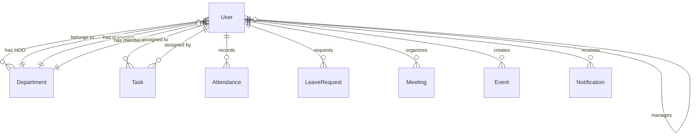

# Backend Roadmap - Part 2: Database Schema & Models

## 🗄️ **Database Architecture Overview**

### **Database Choice: MongoDB**
- **Document-based**: Flexible schema for evolving requirements
- **Scalability**: Horizontal scaling capabilities
- **JSON-like**: Natural fit with Node.js and frontend JSON
- **Indexing**: Powerful indexing for query optimization
- **Aggregation**: Built-in analytics and reporting capabilities

---

## 📊 **Complete Database Schema**

### **1. Users Collection**

```typescript
interface IUser extends Document {
  // Personal Information
  username: string;           // Unique identifier
  email: string;             // Unique email address
  password: string;          // Hashed password
  firstName: string;         // First name
  lastName: string;          // Last name
  
  // Role & Hierarchy
  role: UserRole;           // Enum: super_admin, admin, hr, hr_manager, hod, manager, member
  department: ObjectId;     // Reference to Department
  manager: ObjectId;        // Reference to User (manager)
  
  // Contact & Personal Details
  phone?: string;           // Phone number
  avatar?: string;          // Profile image URL
  dateOfBirth?: Date;       // Date of birth
  address?: {
    street: string;
    city: string;
    state: string;
    zipCode: string;
    country: string;
  };
  
  // Employment Details
  employeeId: string;       // Unique employee identifier
  dateOfJoining: Date;      // Joining date
  position?: string;        // Job position/title
  salary?: number;          // Salary information
  status: UserStatus;       // Enum: active, inactive, suspended, terminated
  
  // Permissions & Settings
  permissions: string[];    // Array of permission strings
  preferences: {
    notifications: {
      email: boolean;
      push: boolean;
      sms: boolean;
    };
    theme: string;          // UI theme preference
    language: string;       // Language preference
  };
  
  // Security
  lastLogin?: Date;         // Last login timestamp
  passwordResetToken?: string;
  passwordResetExpires?: Date;
  emailVerificationToken?: string;
  isEmailVerified: boolean;
  loginAttempts?: number;   // Failed login attempts
  lockUntil?: Date;         // Account lock until timestamp
  
  // Timestamps
  createdAt: Date;
  updatedAt: Date;
}

enum UserRole {
  SUPER_ADMIN = 'super_admin',
  ADMIN = 'admin',
  HR = 'hr',
  HR_MANAGER = 'hr_manager',
  HOD = 'hod',
  MANAGER = 'manager',
  MEMBER = 'member'
}

enum UserStatus {
  ACTIVE = 'active',
  INACTIVE = 'inactive',
  SUSPENDED = 'suspended',
  TERMINATED = 'terminated'
}
```

### **2. Departments Collection**

```typescript
interface IDepartment extends Document {
  // Basic Information
  name: string;             // Department name (unique)
  description?: string;     // Department description
  code: string;            // Department code (unique)
  
  // Hierarchy
  hod: ObjectId;           // Reference to User (Head of Department)
  managers: ObjectId[];    // Array of Manager references
  members: ObjectId[];     // Array of Member references
  parentDepartment?: ObjectId; // Reference to parent department
  subDepartments: ObjectId[];  // Array of sub-department references
  
  // Settings
  color: string;           // Department color for UI
  budget?: number;         // Department budget
  status: DepartmentStatus; // Enum: active, inactive, archived
  location?: {
    building: string;
    floor: string;
    address: string;
  };
  
  // Metadata
  createdBy: ObjectId;     // Reference to User who created
  createdAt: Date;
  updatedAt: Date;
}

enum DepartmentStatus {
  ACTIVE = 'active',
  INACTIVE = 'inactive',
  ARCHIVED = 'archived'
}
```

### **3. Tasks Collection**

```typescript
interface ITask extends Document {
  // Basic Information
  title: string;           // Task title
  description: string;     // Task description
  taskNumber: string;      // Unique task identifier
  
  // Assignment
  assignedTo: ObjectId;    // Reference to User (assignee)
  assignedBy: ObjectId;    // Reference to User (assigner)
  assignedByRole: UserRole; // Role of the assigner
  department: ObjectId;    // Reference to Department
  manager?: ObjectId;      // Reference to Manager (if applicable)
  
  // Status & Priority
  status: TaskStatus;      // Enum: assigned, in_progress, completed, blocked, cancelled
  priority: TaskPriority;  // Enum: low, medium, high, urgent
  progress: number;        // Progress percentage (0-100)
  
  // Timing
  dueDate: Date;          // Task due date
  startDate?: Date;       // Task start date
  completedDate?: Date;   // Task completion date
  estimatedHours?: number; // Estimated hours to complete
  actualHours?: number;   // Actual hours spent
  
  // Additional Details
  tags: string[];         // Task tags for categorization
  category?: string;      // Task category
  attachments: {
    id: string;
    name: string;
    url: string;
    size: number;
    type: string;
    uploadedBy: ObjectId;
    uploadedAt: Date;
  }[];
  
  // Meeting Integration
  meeting?: {
    enabled: boolean;
    meetingId?: ObjectId;   // Reference to Meeting
    scheduledDate?: Date;
    location?: string;
    meetingLink?: string;
  };
  
  // Comments & Activity
  comments: {
    id: string;
    userId: ObjectId;
    content: string;
    createdAt: Date;
    editedAt?: Date;
  }[];
  
  // Workflow
  subtasks: {
    id: string;
    title: string;
    completed: boolean;
    assignedTo?: ObjectId;
    dueDate?: Date;
  }[];
  
  // Timestamps
  createdAt: Date;
  updatedAt: Date;
}

enum TaskStatus {
  ASSIGNED = 'assigned',
  IN_PROGRESS = 'in_progress',
  COMPLETED = 'completed',
  BLOCKED = 'blocked',
  CANCELLED = 'cancelled'
}

enum TaskPriority {
  LOW = 'low',
  MEDIUM = 'medium',
  HIGH = 'high',
  URGENT = 'urgent'
}
```

### **4. Attendance Collection**

```typescript
interface IAttendance extends Document {
  // User & Date
  user: ObjectId;          // Reference to User
  date: Date;             // Attendance date (YYYY-MM-DD format)
  
  // Check-in/out Details
  checkIn: {
    time: Date;           // Check-in timestamp
    location?: {
      latitude: number;
      longitude: number;
      address: string;
    };
    ip: string;           // IP address
    device: string;       // Device information
  };
  
  checkOut?: {
    time: Date;           // Check-out timestamp
    location?: {
      latitude: number;
      longitude: number;
      address: string;
    };
    ip: string;           // IP address
    device: string;       // Device information
  };
  
  // Calculated Fields
  totalHours?: number;    // Total working hours
  isLate: boolean;       // Late arrival flag
  isEarlyLeave: boolean; // Early leave flag
  breakTime?: number;    // Total break time in minutes
  
  // Status
  status: AttendanceStatus; // Enum: present, absent, partial, leave
  
  // Break Records
  breaks: {
    id: string;
    startTime: Date;
    endTime?: Date;
    reason?: string;
  }[];
  
  // Overtime
  overtime?: {
    hours: number;
    approved: boolean;
    approvedBy?: ObjectId;
    reason?: string;
  };
  
  // Notes
  notes?: string;        // Admin notes
  
  // Timestamps
  createdAt: Date;
  updatedAt: Date;
}

enum AttendanceStatus {
  PRESENT = 'present',
  ABSENT = 'absent',
  PARTIAL = 'partial',
  LEAVE = 'leave'
}
```

### **5. Leave Requests Collection**

```typescript
interface ILeaveRequest extends Document {
  // Employee Information
  employee: ObjectId;      // Reference to User
  department: ObjectId;    // Reference to Department
  manager: ObjectId;       // Reference to Manager
  
  // Leave Details
  leaveType: LeaveType;    // Enum: annual, sick, maternity, etc.
  startDate: Date;         // Leave start date
  endDate: Date;           // Leave end date
  totalDays: number;       // Total leave days
  isHalfDay: boolean;      // Half day flag
  halfDayPeriod?: 'morning' | 'afternoon';
  
  // Request Information
  reason: string;          // Leave reason
  emergencyContact?: {
    name: string;
    phone: string;
    relationship: string;
  };
  
  // Status & Approval
  status: LeaveStatus;     // Enum: pending, approved, rejected, cancelled
  appliedDate: Date;       // Application date
  
  // Approval Workflow
  approvals: {
    level: number;         // Approval level (1, 2, 3...)
    approver: ObjectId;    // Reference to approver
    status: 'pending' | 'approved' | 'rejected';
    comments?: string;
    date?: Date;
  }[];
  
  // Documents
  documents: {
    id: string;
    name: string;
    url: string;
    type: string;
    uploadedAt: Date;
  }[];
  
  // Final Decision
  finalApprover?: ObjectId; // Final approver reference
  approvedDate?: Date;     // Final approval date
  rejectionReason?: string;
  
  // Leave Balance Impact
  balanceSnapshot: {
    beforeBalance: number;
    afterBalance: number;
    leaveType: LeaveType;
  };
  
  // Timestamps
  createdAt: Date;
  updatedAt: Date;
}

enum LeaveType {
  ANNUAL = 'annual',
  SICK = 'sick',
  MATERNITY = 'maternity',
  PATERNITY = 'paternity',
  EMERGENCY = 'emergency',
  UNPAID = 'unpaid',
  COMPENSATORY = 'compensatory',
  BEREAVEMENT = 'bereavement'
}

enum LeaveStatus {
  PENDING = 'pending',
  APPROVED = 'approved',
  REJECTED = 'rejected',
  CANCELLED = 'cancelled'
}
```

### **6. Leave Balances Collection**

```typescript
interface ILeaveBalance extends Document {
  // Employee & Period
  employee: ObjectId;      // Reference to User
  year: number;           // Leave year
  leaveType: LeaveType;   // Leave type
  
  // Balance Details
  totalAllowed: number;   // Total allowed leave days
  used: number;           // Used leave days
  pending: number;        // Pending approval days
  available: number;      // Available balance (calculated)
  carryForward: number;   // Carried forward from previous year
  
  // Policy Reference
  policy: ObjectId;       // Reference to LeavePolicy
  
  // History
  transactions: {
    id: string;
    type: 'credit' | 'debit' | 'adjustment';
    amount: number;
    reason: string;
    relatedRequest?: ObjectId;
    date: Date;
    processedBy: ObjectId;
  }[];
  
  // Timestamps
  createdAt: Date;
  updatedAt: Date;
}
```

### **7. Meetings Collection**

```typescript
interface IMeeting extends Document {
  // Basic Information
  title: string;           // Meeting title
  description: string;     // Meeting description
  agenda?: string;         // Meeting agenda
  
  // Scheduling
  date: Date;             // Meeting date and time
  duration: number;       // Duration in minutes
  timezone: string;       // Timezone
  
  // Location
  type: 'physical' | 'virtual' | 'hybrid';
  location?: string;      // Physical location
  meetingLink?: string;   // Virtual meeting link
  meetingRoom?: ObjectId; // Reference to meeting room
  
  // Organizer & Attendees
  organizer: ObjectId;    // Reference to User (organizer)
  attendees: {
    user: ObjectId;       // Reference to User
    role: 'required' | 'optional';
    status: 'pending' | 'accepted' | 'declined' | 'tentative';
    responseDate?: Date;
  }[];
  
  // Department & Access
  departments?: ObjectId[]; // Department-level meetings
  isPublic: boolean;      // Public/private flag
  
  // Status
  status: MeetingStatus;  // Enum: scheduled, in_progress, completed, cancelled, postponed
  
  // Related Records
  relatedTask?: ObjectId; // Reference to Task (if applicable)
  parentMeeting?: ObjectId; // Reference to parent meeting (for recurring)
  
  // Recurring
  recurring?: {
    enabled: boolean;
    pattern: 'daily' | 'weekly' | 'monthly' | 'custom';
    interval: number;     // Every N days/weeks/months
    endDate?: Date;       // Recurring end date
    occurrences?: number; // Number of occurrences
  };
  
  // Meeting Notes & Follow-ups
  notes?: string;         // Meeting notes
  actionItems: {
    id: string;
    task: string;
    assignedTo: ObjectId;
    dueDate?: Date;
    completed: boolean;
  }[];
  
  // Attachments
  attachments: {
    id: string;
    name: string;
    url: string;
    size: number;
    type: string;
    uploadedBy: ObjectId;
    uploadedAt: Date;
  }[];
  
  // Timestamps
  createdAt: Date;
  updatedAt: Date;
}

enum MeetingStatus {
  SCHEDULED = 'scheduled',
  IN_PROGRESS = 'in_progress',
  COMPLETED = 'completed',
  CANCELLED = 'cancelled',
  POSTPONED = 'postponed'
}
```

### **8. Events Collection**

```typescript
interface IEvent extends Document {
  // Basic Information
  title: string;          // Event title
  description: string;    // Event description
  type: EventType;        // Enum: meeting, training, announcement, etc.
  
  // Timing
  startDate: Date;        // Event start date and time
  endDate: Date;          // Event end date and time
  isAllDay: boolean;      // All day event flag
  timezone: string;       // Event timezone
  
  // Media & Attachments
  posterImage?: string;   // Event poster image URL
  attachments: {
    id: string;
    name: string;
    url: string;
    size: number;
    type: string;
    uploadedAt: Date;
  }[];
  
  // Virtual Event
  isOnline: boolean;      // Online event flag
  meetingLink?: string;   // Virtual event link
  streamingUrl?: string;  // Live streaming URL
  
  // Visibility & Access
  visibility: EventVisibility; // Enum: all, managers_only, etc.
  allowedDepartments?: ObjectId[]; // Department-based access
  allowedRoles?: UserRole[];      // Role-based access
  allowedUsers?: ObjectId[];      // User-specific access
  
  // Registration
  requiresRegistration: boolean;
  maxAttendees?: number;
  registeredUsers: {
    user: ObjectId;
    registeredAt: Date;
    status: 'registered' | 'attended' | 'cancelled';
  }[];
  
  // Location
  location?: {
    venue: string;
    address: string;
    city: string;
    coordinates?: {
      latitude: number;
      longitude: number;
    };
  };
  
  // Organizer
  createdBy: ObjectId;    // Reference to User (creator)
  organizers: ObjectId[]; // Additional organizers
  
  // Status & Settings
  status: EventStatus;    // Enum: draft, published, cancelled, completed
  isActive: boolean;      // Active/inactive flag
  tags: string[];         // Event tags
  category?: string;      // Event category
  
  // Notifications
  notifications: {
    beforeEvent: number[]; // Minutes before event [30, 60, 1440]
    sent: {
      time: number;
      sentAt: Date;
    }[];
  };
  
  // Timestamps
  createdAt: Date;
  updatedAt: Date;
}

enum EventType {
  MEETING = 'meeting',
  TRAINING = 'training',
  ANNOUNCEMENT = 'announcement',
  CELEBRATION = 'celebration',
  DEADLINE = 'deadline',
  CONFERENCE = 'conference',
  WORKSHOP = 'workshop',
  OTHER = 'other'
}

enum EventVisibility {
  ALL = 'all',
  MANAGERS_ONLY = 'managers_only',
  DEPARTMENT_SPECIFIC = 'department_specific',
  ROLE_SPECIFIC = 'role_specific',
  USER_SPECIFIC = 'user_specific'
}

enum EventStatus {
  DRAFT = 'draft',
  PUBLISHED = 'published',
  CANCELLED = 'cancelled',
  COMPLETED = 'completed'
}
```

### **9. Notifications Collection**

```typescript
interface INotification extends Document {
  // Recipient
  recipient: ObjectId;    // Reference to User
  
  // Content
  title: string;          // Notification title
  message: string;        // Notification message
  type: NotificationType; // Enum: info, warning, error, success
  category: NotificationCategory; // Enum: task, leave, meeting, etc.
  
  // Related Data
  relatedEntity?: {
    type: 'task' | 'leave' | 'meeting' | 'event' | 'user';
    id: ObjectId;         // Reference to related entity
  };
  
  // Status
  isRead: boolean;        // Read status
  readAt?: Date;          // Read timestamp
  
  // Delivery
  channels: {
    push: {
      sent: boolean;
      sentAt?: Date;
      deviceTokens?: string[];
    };
    email: {
      sent: boolean;
      sentAt?: Date;
      emailAddress?: string;
    };
    sms: {
      sent: boolean;
      sentAt?: Date;
      phoneNumber?: string;
    };
  };
  
  // Priority & Scheduling
  priority: 'low' | 'medium' | 'high' | 'urgent';
  scheduledFor?: Date;    // Scheduled delivery time
  expiresAt?: Date;       // Notification expiry
  
  // Action
  actionRequired: boolean;
  actionUrl?: string;     // Deep link or URL
  actionText?: string;    // Action button text
  
  // Sender
  sender?: ObjectId;      // Reference to User (if applicable)
  
  // Timestamps
  createdAt: Date;
  updatedAt: Date;
}

enum NotificationType {
  INFO = 'info',
  WARNING = 'warning',
  ERROR = 'error',
  SUCCESS = 'success'
}

enum NotificationCategory {
  TASK = 'task',
  LEAVE = 'leave',
  MEETING = 'meeting',
  EVENT = 'event',
  ATTENDANCE = 'attendance',
  SYSTEM = 'system',
  ANNOUNCEMENT = 'announcement'
}
```

---

## 🔗 **Database Relationships**

### **Primary Relationships**



### **Index Strategy**

```typescript
// User Collection Indexes
db.users.createIndex({ email: 1 }, { unique: true })
db.users.createIndex({ username: 1 }, { unique: true })
db.users.createIndex({ role: 1, status: 1 })
db.users.createIndex({ department: 1 })
db.users.createIndex({ manager: 1 })

// Task Collection Indexes
db.tasks.createIndex({ assignedTo: 1, status: 1 })
db.tasks.createIndex({ department: 1, dueDate: 1 })
db.tasks.createIndex({ createdAt: -1 })
db.tasks.createIndex({ status: 1, priority: 1 })

// Attendance Collection Indexes
db.attendance.createIndex({ user: 1, date: 1 }, { unique: true })
db.attendance.createIndex({ date: -1 })
db.attendance.createIndex({ user: 1, createdAt: -1 })

// Leave Request Collection Indexes
db.leaveRequests.createIndex({ employee: 1, status: 1 })
db.leaveRequests.createIndex({ startDate: 1, endDate: 1 })
db.leaveRequests.createIndex({ appliedDate: -1 })
```

---

**Next:** [Backend Roadmap Part 3: API Architecture & Endpoints](./BACKEND_ROADMAP_03_API_ARCHITECTURE.md)


