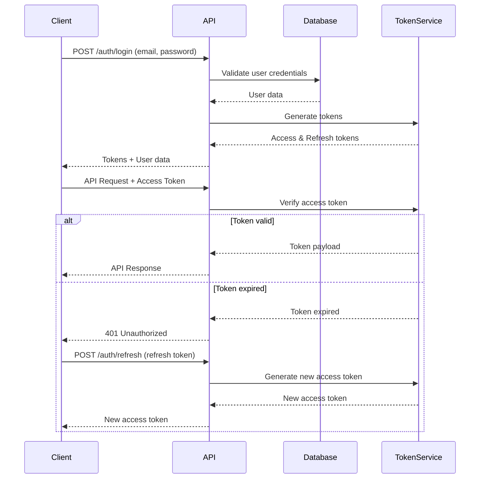

# Backend Roadmap - Part 4: Authentication & Security

## 🔐 **Authentication Architecture**

### **JWT-Based Authentication System**
- **Access Tokens**: Short-lived (15-30 minutes) for API requests
- **Refresh Tokens**: Long-lived (7-30 days) for token renewal
- **Token Storage**: Secure HTTP-only cookies or localStorage
- **Token Rotation**: Automatic token refresh mechanism

### **Authentication Flow**


---

## 🛡️ **Security Implementation**

### **1. Password Security**

#### **Password Hashing**
```typescript
import bcrypt from 'bcryptjs';
import crypto from 'crypto';

class PasswordService {
  private static readonly SALT_ROUNDS = 12;
  
  static async hashPassword(password: string): Promise<string> {
    return await bcrypt.hash(password, this.SALT_ROUNDS);
  }
  
  static async comparePassword(password: string, hash: string): Promise<boolean> {
    return await bcrypt.compare(password, hash);
  }
  
  static generateResetToken(): string {
    return crypto.randomBytes(32).toString('hex');
  }
  
  static validatePasswordStrength(password: string): boolean {
    const minLength = 8;
    const hasUpperCase = /[A-Z]/.test(password);
    const hasLowerCase = /[a-z]/.test(password);
    const hasNumbers = /\d/.test(password);
    const hasSpecialChar = /[!@#$%^&*(),.?":{}|<>]/.test(password);
    
    return password.length >= minLength && 
           hasUpperCase && 
           hasLowerCase && 
           hasNumbers && 
           hasSpecialChar;
  }
}
```

#### **Password Policy Configuration**
```typescript
interface PasswordPolicy {
  minLength: number;
  requireUppercase: boolean;
  requireLowercase: boolean;
  requireNumbers: boolean;
  requireSpecialChars: boolean;
  preventReuse: number; // Prevent reusing last N passwords
  maxAge: number; // Force password change after N days
  lockoutThreshold: number; // Lock account after N failed attempts
  lockoutDuration: number; // Lock duration in minutes
}

const defaultPasswordPolicy: PasswordPolicy = {
  minLength: 8,
  requireUppercase: true,
  requireLowercase: true,
  requireNumbers: true,
  requireSpecialChars: true,
  preventReuse: 5,
  maxAge: 90, // 90 days
  lockoutThreshold: 5,
  lockoutDuration: 30 // 30 minutes
};
```

### **2. JWT Token Management**

#### **Token Service Implementation**
```typescript
import jwt from 'jsonwebtoken';
import { Redis } from 'ioredis';

interface TokenPayload {
  userId: string;
  email: string;
  role: string;
  department: string;
  permissions: string[];
  iat: number;
  exp: number;
}

class TokenService {
  private redis: Redis;
  private accessTokenSecret: string;
  private refreshTokenSecret: string;
  private accessTokenExpiry: string = '15m';
  private refreshTokenExpiry: string = '7d';
  
  constructor() {
    this.redis = new Redis(process.env.REDIS_URL!);
    this.accessTokenSecret = process.env.ACCESS_TOKEN_SECRET!;
    this.refreshTokenSecret = process.env.REFRESH_TOKEN_SECRET!;
  }
  
  generateAccessToken(payload: Omit<TokenPayload, 'iat' | 'exp'>): string {
    return jwt.sign(payload, this.accessTokenSecret, {
      expiresIn: this.accessTokenExpiry,
      issuer: 'tiny-typer-tool',
      audience: 'tiny-typer-users'
    });
  }
  
  generateRefreshToken(userId: string): string {
    const payload = { userId, type: 'refresh' };
    return jwt.sign(payload, this.refreshTokenSecret, {
      expiresIn: this.refreshTokenExpiry
    });
  }
  
  async verifyAccessToken(token: string): Promise<TokenPayload> {
    try {
      const payload = jwt.verify(token, this.accessTokenSecret) as TokenPayload;
      
      // Check if token is blacklisted
      const isBlacklisted = await this.isTokenBlacklisted(token);
      if (isBlacklisted) {
        throw new Error('Token has been revoked');
      }
      
      return payload;
    } catch (error) {
      throw new Error('Invalid or expired token');
    }
  }
  
  async verifyRefreshToken(token: string): Promise<{ userId: string }> {
    try {
      const payload = jwt.verify(token, this.refreshTokenSecret) as any;
      
      // Check if refresh token exists in Redis
      const storedToken = await this.redis.get(`refresh_token:${payload.userId}`);
      if (!storedToken || storedToken !== token) {
        throw new Error('Invalid refresh token');
      }
      
      return { userId: payload.userId };
    } catch (error) {
      throw new Error('Invalid refresh token');
    }
  }
  
  async storeRefreshToken(userId: string, token: string): Promise<void> {
    // Store refresh token in Redis with expiry
    await this.redis.setex(`refresh_token:${userId}`, 604800, token); // 7 days
  }
  
  async revokeRefreshToken(userId: string): Promise<void> {
    await this.redis.del(`refresh_token:${userId}`);
  }
  
  async blacklistToken(token: string): Promise<void> {
    const decoded = jwt.decode(token) as any;
    const expiryTime = decoded.exp - Math.floor(Date.now() / 1000);
    
    if (expiryTime > 0) {
      await this.redis.setex(`blacklisted_token:${token}`, expiryTime, 'true');
    }
  }
  
  private async isTokenBlacklisted(token: string): Promise<boolean> {
    const result = await this.redis.get(`blacklisted_token:${token}`);
    return result === 'true';
  }
}
```

### **3. Role-Based Access Control (RBAC)**

#### **Permission System**
```typescript
enum Permission {
  // User Management
  USER_CREATE = 'user:create',
  USER_READ = 'user:read',
  USER_UPDATE = 'user:update',
  USER_DELETE = 'user:delete',
  USER_CHANGE_PASSWORD = 'user:change_password',
  
  // Department Management
  DEPARTMENT_CREATE = 'department:create',
  DEPARTMENT_READ = 'department:read',
  DEPARTMENT_UPDATE = 'department:update',
  DEPARTMENT_DELETE = 'department:delete',
  DEPARTMENT_MANAGE_MEMBERS = 'department:manage_members',
  
  // Task Management
  TASK_CREATE = 'task:create',
  TASK_READ = 'task:read',
  TASK_UPDATE = 'task:update',
  TASK_DELETE = 'task:delete',
  TASK_ASSIGN = 'task:assign',
  
  // Leave Management
  LEAVE_CREATE = 'leave:create',
  LEAVE_READ = 'leave:read',
  LEAVE_APPROVE = 'leave:approve',
  LEAVE_REJECT = 'leave:reject',
  LEAVE_DELETE = 'leave:delete',
  
  // Analytics & Reports
  ANALYTICS_VIEW = 'analytics:view',
  REPORTS_GENERATE = 'reports:generate',
  REPORTS_EXPORT = 'reports:export',
  
  // System Administration
  SYSTEM_SETTINGS = 'system:settings',
  SYSTEM_LOGS = 'system:logs',
  SYSTEM_BACKUP = 'system:backup'
}

const RolePermissions: Record<string, Permission[]> = {
  super_admin: Object.values(Permission),
  
  admin: [
    Permission.USER_CREATE,
    Permission.USER_READ,
    Permission.USER_UPDATE,
    Permission.USER_DELETE,
    Permission.USER_CHANGE_PASSWORD,
    Permission.DEPARTMENT_CREATE,
    Permission.DEPARTMENT_READ,
    Permission.DEPARTMENT_UPDATE,
    Permission.DEPARTMENT_DELETE,
    Permission.DEPARTMENT_MANAGE_MEMBERS,
    Permission.TASK_CREATE,
    Permission.TASK_READ,
    Permission.TASK_UPDATE,
    Permission.TASK_DELETE,
    Permission.TASK_ASSIGN,
    Permission.ANALYTICS_VIEW,
    Permission.REPORTS_GENERATE,
    Permission.REPORTS_EXPORT
  ],
  
  hr: [
    Permission.USER_READ,
    Permission.USER_UPDATE,
    Permission.USER_CHANGE_PASSWORD,
    Permission.LEAVE_READ,
    Permission.LEAVE_APPROVE,
    Permission.LEAVE_REJECT,
    Permission.ANALYTICS_VIEW,
    Permission.REPORTS_GENERATE
  ],
  
  hr_manager: [
    Permission.USER_CREATE,
    Permission.USER_READ,
    Permission.USER_UPDATE,
    Permission.LEAVE_READ,
    Permission.LEAVE_APPROVE,
    Permission.LEAVE_REJECT,
    Permission.ANALYTICS_VIEW,
    Permission.REPORTS_GENERATE
  ],
  
  hod: [
    Permission.USER_READ,
    Permission.DEPARTMENT_READ,
    Permission.DEPARTMENT_MANAGE_MEMBERS,
    Permission.TASK_CREATE,
    Permission.TASK_READ,
    Permission.TASK_UPDATE,
    Permission.TASK_ASSIGN,
    Permission.LEAVE_READ,
    Permission.LEAVE_APPROVE,
    Permission.LEAVE_REJECT,
    Permission.ANALYTICS_VIEW
  ],
  
  manager: [
    Permission.USER_READ,
    Permission.TASK_CREATE,
    Permission.TASK_READ,
    Permission.TASK_UPDATE,
    Permission.TASK_ASSIGN,
    Permission.LEAVE_READ,
    Permission.LEAVE_APPROVE,
    Permission.ANALYTICS_VIEW
  ],
  
  member: [
    Permission.USER_READ,
    Permission.TASK_READ,
    Permission.TASK_UPDATE,
    Permission.LEAVE_CREATE,
    Permission.LEAVE_READ
  ]
};
```

#### **Authorization Middleware**
```typescript
import { Request, Response, NextFunction } from 'express';

interface AuthRequest extends Request {
  user?: TokenPayload;
}

class AuthorizationMiddleware {
  static requirePermission(...requiredPermissions: Permission[]) {
    return (req: AuthRequest, res: Response, next: NextFunction) => {
      const user = req.user;
      
      if (!user) {
        return res.status(401).json({
          success: false,
          message: 'Authentication required'
        });
      }
      
      const userPermissions = RolePermissions[user.role] || [];
      const hasPermission = requiredPermissions.some(permission => 
        userPermissions.includes(permission)
      );
      
      if (!hasPermission) {
        return res.status(403).json({
          success: false,
          message: 'Insufficient permissions'
        });
      }
      
      next();
    };
  }
  
  static requireRole(...allowedRoles: string[]) {
    return (req: AuthRequest, res: Response, next: NextFunction) => {
      const user = req.user;
      
      if (!user) {
        return res.status(401).json({
          success: false,
          message: 'Authentication required'
        });
      }
      
      if (!allowedRoles.includes(user.role)) {
        return res.status(403).json({
          success: false,
          message: 'Role not authorized'
        });
      }
      
      next();
    };
  }
  
  static requireSelfOrRole(...allowedRoles: string[]) {
    return (req: AuthRequest, res: Response, next: NextFunction) => {
      const user = req.user;
      const targetUserId = req.params.id || req.params.userId;
      
      if (!user) {
        return res.status(401).json({
          success: false,
          message: 'Authentication required'
        });
      }
      
      // Allow if user is accessing their own data
      if (user.userId === targetUserId) {
        return next();
      }
      
      // Allow if user has required role
      if (allowedRoles.includes(user.role)) {
        return next();
      }
      
      return res.status(403).json({
        success: false,
        message: 'Access denied'
      });
    };
  }
}
```

---

## 🔒 **Security Middleware**

### **1. Authentication Middleware**
```typescript
class AuthenticationMiddleware {
  private tokenService: TokenService;
  
  constructor() {
    this.tokenService = new TokenService();
  }
  
  authenticate = async (req: AuthRequest, res: Response, next: NextFunction) => {
    try {
      const authHeader = req.headers.authorization;
      
      if (!authHeader || !authHeader.startsWith('Bearer ')) {
        return res.status(401).json({
          success: false,
          message: 'Access token required'
        });
      }
      
      const token = authHeader.substring(7);
      const payload = await this.tokenService.verifyAccessToken(token);
      
      // Add user data to request
      req.user = payload;
      
      // Update last activity
      await this.updateLastActivity(payload.userId);
      
      next();
    } catch (error) {
      return res.status(401).json({
        success: false,
        message: 'Invalid or expired token'
      });
    }
  };
  
  private async updateLastActivity(userId: string): Promise<void> {
    // Update user's last activity timestamp
    await User.findByIdAndUpdate(userId, {
      lastActivity: new Date()
    });
  }
}
```

### **2. Rate Limiting**
```typescript
import rateLimit from 'express-rate-limit';
import { Redis } from 'ioredis';

class RateLimiter {
  private redis: Redis;
  
  constructor() {
    this.redis = new Redis(process.env.REDIS_URL!);
  }
  
  // General API rate limiting
  static general = rateLimit({
    windowMs: 15 * 60 * 1000, // 15 minutes
    max: 1000, // Limit each IP to 1000 requests per windowMs
    message: {
      success: false,
      message: 'Too many requests, please try again later'
    },
    standardHeaders: true,
    legacyHeaders: false
  });
  
  // Auth endpoints rate limiting
  static auth = rateLimit({
    windowMs: 15 * 60 * 1000, // 15 minutes
    max: 10, // Limit each IP to 10 login attempts per windowMs
    message: {
      success: false,
      message: 'Too many authentication attempts, please try again later'
    },
    skipSuccessfulRequests: true
  });
  
  // Password reset rate limiting
  static passwordReset = rateLimit({
    windowMs: 60 * 60 * 1000, // 1 hour
    max: 3, // Limit each IP to 3 password reset requests per hour
    message: {
      success: false,
      message: 'Too many password reset attempts, please try again later'
    }
  });
  
  // File upload rate limiting
  static fileUpload = rateLimit({
    windowMs: 15 * 60 * 1000, // 15 minutes
    max: 50, // Limit each user to 50 file uploads per windowMs
    message: {
      success: false,
      message: 'Too many file uploads, please try again later'
    }
  });
}
```

### **3. Input Validation & Sanitization**
```typescript
import Joi from 'joi';
import DOMPurify from 'isomorphic-dompurify';

class ValidationMiddleware {
  static validateRequest(schema: Joi.ObjectSchema) {
    return (req: Request, res: Response, next: NextFunction) => {
      const { error, value } = schema.validate(req.body, {
        abortEarly: false,
        stripUnknown: true
      });
      
      if (error) {
        const errors = error.details.map(detail => ({
          field: detail.path.join('.'),
          message: detail.message
        }));
        
        return res.status(400).json({
          success: false,
          message: 'Validation failed',
          errors
        });
      }
      
      // Sanitize input
      req.body = this.sanitizeInput(value);
      next();
    };
  }
  
  private static sanitizeInput(data: any): any {
    if (typeof data === 'string') {
      return DOMPurify.sanitize(data);
    } else if (Array.isArray(data)) {
      return data.map(item => this.sanitizeInput(item));
    } else if (typeof data === 'object' && data !== null) {
      const sanitized: any = {};
      for (const [key, value] of Object.entries(data)) {
        sanitized[key] = this.sanitizeInput(value);
      }
      return sanitized;
    }
    return data;
  }
}

// Validation Schemas
const ValidationSchemas = {
  userRegistration: Joi.object({
    username: Joi.string().alphanum().min(3).max(30).required(),
    email: Joi.string().email().required(),
    password: Joi.string().min(8).pattern(
      /^(?=.*[a-z])(?=.*[A-Z])(?=.*\d)(?=.*[@$!%*?&])[A-Za-z\d@$!%*?&]/
    ).required(),
    firstName: Joi.string().min(2).max(50).required(),
    lastName: Joi.string().min(2).max(50).required(),
    role: Joi.string().valid('super_admin', 'admin', 'hr', 'hr_manager', 'hod', 'manager', 'member'),
    departmentId: Joi.string().optional(),
    phone: Joi.string().pattern(/^[+]?[\d\s-()]+$/).optional()
  }),
  
  userLogin: Joi.object({
    email: Joi.string().email().required(),
    password: Joi.string().required(),
    rememberMe: Joi.boolean().default(false)
  }),
  
  taskCreation: Joi.object({
    title: Joi.string().min(3).max(200).required(),
    description: Joi.string().min(10).max(2000).required(),
    assignedTo: Joi.string().required(),
    departmentId: Joi.string().required(),
    priority: Joi.string().valid('low', 'medium', 'high', 'urgent').required(),
    dueDate: Joi.date().greater('now').required(),
    estimatedHours: Joi.number().min(0).max(1000).optional(),
    tags: Joi.array().items(Joi.string()).optional()
  }),
  
  leaveRequest: Joi.object({
    leaveType: Joi.string().valid('annual', 'sick', 'maternity', 'paternity', 'emergency', 'unpaid').required(),
    startDate: Joi.date().greater('now').required(),
    endDate: Joi.date().greater(Joi.ref('startDate')).required(),
    reason: Joi.string().min(10).max(500).required(),
    isHalfDay: Joi.boolean().default(false),
    halfDayPeriod: Joi.string().valid('morning', 'afternoon').when('isHalfDay', {
      is: true,
      then: Joi.required()
    })
  })
};
```

### **4. Security Headers & CORS**
```typescript
import helmet from 'helmet';
import cors from 'cors';

class SecurityMiddleware {
  static setupSecurity(app: Express) {
    // Security headers
    app.use(helmet({
      contentSecurityPolicy: {
        directives: {
          defaultSrc: ["'self'"],
          styleSrc: ["'self'", "'unsafe-inline'"],
          scriptSrc: ["'self'"],
          imgSrc: ["'self'", "data:", "https:"],
          connectSrc: ["'self'"],
          fontSrc: ["'self'"],
          objectSrc: ["'none'"],
          mediaSrc: ["'self'"],
          frameSrc: ["'none'"]
        }
      },
      crossOriginEmbedderPolicy: false
    }));
    
    // CORS configuration
    app.use(cors({
      origin: (origin, callback) => {
        const allowedOrigins = process.env.ALLOWED_ORIGINS?.split(',') || ['http://localhost:3000'];
        
        if (!origin || allowedOrigins.includes(origin)) {
          callback(null, true);
        } else {
          callback(new Error('Not allowed by CORS'));
        }
      },
      credentials: true,
      methods: ['GET', 'POST', 'PUT', 'PATCH', 'DELETE'],
      allowedHeaders: ['Content-Type', 'Authorization']
    }));
    
    // Request size limiting
    app.use(express.json({ limit: '10mb' }));
    app.use(express.urlencoded({ extended: true, limit: '10mb' }));
  }
}
```

---

## 🗝️ **Session Management**

### **Redis Session Store**
```typescript
import session from 'express-session';
import RedisStore from 'connect-redis';
import { Redis } from 'ioredis';

class SessionManager {
  private redis: Redis;
  
  constructor() {
    this.redis = new Redis(process.env.REDIS_URL!);
  }
  
  setupSessions(app: Express) {
    const store = new RedisStore({
      client: this.redis,
      prefix: 'sess:'
    });
    
    app.use(session({
      store: store,
      secret: process.env.SESSION_SECRET!,
      resave: false,
      saveUninitialized: false,
      cookie: {
        secure: process.env.NODE_ENV === 'production',
        httpOnly: true,
        maxAge: 1000 * 60 * 60 * 24 * 7, // 7 days
        sameSite: 'strict'
      },
      name: 'tiny-typer-session'
    }));
  }
  
  async createSession(userId: string, sessionData: any): Promise<string> {
    const sessionId = crypto.randomUUID();
    const sessionKey = `session:${sessionId}`;
    
    await this.redis.setex(sessionKey, 3600 * 24 * 7, JSON.stringify({
      userId,
      ...sessionData,
      createdAt: new Date().toISOString()
    }));
    
    return sessionId;
  }
  
  async getSession(sessionId: string): Promise<any> {
    const sessionKey = `session:${sessionId}`;
    const sessionData = await this.redis.get(sessionKey);
    
    if (!sessionData) {
      return null;
    }
    
    return JSON.parse(sessionData);
  }
  
  async destroySession(sessionId: string): Promise<void> {
    const sessionKey = `session:${sessionId}`;
    await this.redis.del(sessionKey);
  }
}
```

---

## 🔍 **Security Monitoring & Logging**

### **Security Event Logging**
```typescript
import winston from 'winston';

class SecurityLogger {
  private logger: winston.Logger;
  
  constructor() {
    this.logger = winston.createLogger({
      format: winston.format.combine(
        winston.format.timestamp(),
        winston.format.json()
      ),
      transports: [
        new winston.transports.File({ filename: 'security.log' }),
        new winston.transports.Console()
      ]
    });
  }
  
  logSecurityEvent(event: string, details: any, req?: Request) {
    this.logger.info('SECURITY_EVENT', {
      event,
      details,
      ip: req?.ip,
      userAgent: req?.get('User-Agent'),
      timestamp: new Date().toISOString()
    });
  }
  
  logLoginAttempt(email: string, success: boolean, req: Request) {
    this.logSecurityEvent('LOGIN_ATTEMPT', {
      email,
      success,
      ip: req.ip,
      userAgent: req.get('User-Agent')
    });
  }
  
  logPasswordChange(userId: string, req: Request) {
    this.logSecurityEvent('PASSWORD_CHANGE', {
      userId,
      ip: req.ip,
      userAgent: req.get('User-Agent')
    });
  }
  
  logPermissionViolation(userId: string, action: string, req: Request) {
    this.logSecurityEvent('PERMISSION_VIOLATION', {
      userId,
      action,
      ip: req.ip,
      userAgent: req.get('User-Agent')
    });
  }
}
```

---

**Next:** [Backend Roadmap Part 5: Implementation & Deployment](./BACKEND_ROADMAP_05_IMPLEMENTATION.md)


