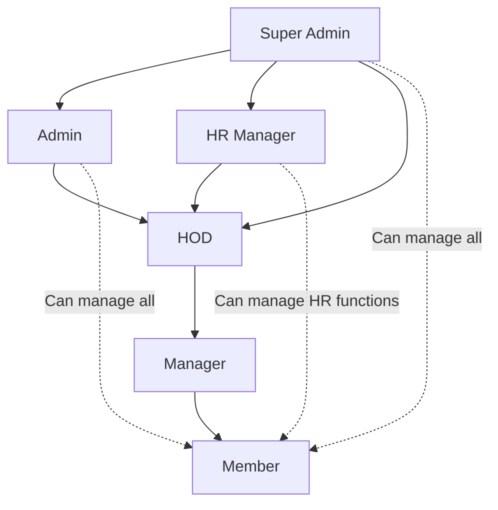

# 🎯 **Tiny Typer Tool - Complete Backend Roadmap**

## 📋 **Roadmap Overview**

यह comprehensive backend roadmap **Tiny Typer Tool HR Management System** के लिए बनाया गया है। इस roadmap में आपको complete backend development का step-by-step guide मिलेगा।

---

## 📑 **Roadmap Parts**

### **[Part 1: Project Overview & Architecture](./BACKEND_ROADMAP_01_PROJECT_OVERVIEW.md)**
- 🎯 Application summary और core features
- 🏗️ Technology stack recommendations 
- 🔄 Role-based access control (RBAC) structure
- 📁 Project structure और development phases
- 🎯 Success metrics और performance targets

### **[Part 2: Database Schema & Models](./BACKEND_ROADMAP_02_DATABASE_SCHEMA.md)**
- 🗄️ Complete MongoDB schema design
- 📊 9 detailed collection schemas (User, Department, Task, Attendance, etc.)
- 🔗 Database relationships और indexing strategy
- 💾 Data modeling best practices

### **[Part 3: API Architecture & Endpoints](./BACKEND_ROADMAP_03_API_ARCHITECTURE.md)**
- 🏗️ RESTful API design principles
- 🔐 Complete authentication endpoints
- 👥 User management APIs with role-based filtering
- 📋 Task, Attendance, Leave, Meeting, Event management APIs
- 🛡️ Error handling और response formats

### **[Part 4: Authentication & Security](./BACKEND_ROADMAP_04_AUTH_SECURITY.md)**
- 🔐 JWT-based authentication system
- 🛡️ Password security और hashing strategies
- 🔒 Role-based access control implementation
- 🛡️ Security middleware (rate limiting, validation, CORS)
- 🔍 Security monitoring और logging

### **[Part 5: Implementation & Deployment](./BACKEND_ROADMAP_05_IMPLEMENTATION.md)**
- 🏗️ Detailed project structure
- 🚀 Phase-wise implementation plan (10 weeks)
- 🧪 Comprehensive testing strategy
- 🐳 Docker containerization
- 🚀 CI/CD pipeline और production deployment
- 📊 Monitoring और performance optimization

---

## 🎯 **Key Features Implemented**

### **✅ Core HR Management Features**
- **User Management**: Hierarchical roles (Super Admin → HOD → Manager → Member)
- **Department Management**: Department hierarchy with proper assignments
- **Task Management**: Multi-level task assignments with priorities और attachments
- **Attendance System**: Check-in/out, working hours tracking, analytics
- **Leave Management**: Leave requests, approval workflow, balance tracking
- **Meeting Management**: Scheduling, organization, virtual meeting support
- **Event Management**: Company events with role-based visibility

### **✅ Advanced Features**
- **Real-time Notifications**: WebSocket-based live notifications
- **Analytics Dashboard**: Role-specific analytics और reports
- **File Management**: Secure file uploads और storage
- **Security Features**: JWT authentication, RBAC, rate limiting
- **Performance Optimization**: Caching, database indexing, query optimization

---

## 🛠️ **Technology Stack**

### **Backend Core**
- **Runtime**: Node.js 18+ with TypeScript
- **Framework**: Express.js with comprehensive middleware
- **Database**: MongoDB with Mongoose ODM
- **Caching**: Redis for sessions और data caching

### **Authentication & Security**
- **Authentication**: JWT tokens (Access + Refresh)
- **Password Security**: bcrypt hashing
- **Security Headers**: Helmet.js, CORS
- **Input Validation**: Joi schema validation
- **Rate Limiting**: Express rate limiter

### **File & Communication**
- **File Storage**: Cloudinary/AWS S3
- **Email Service**: Nodemailer/SendGrid
- **Real-time**: Socket.io for WebSockets
- **Background Jobs**: Bull queue system

### **Development & Deployment**
- **Testing**: Jest with comprehensive test suites
- **Containerization**: Docker with multi-stage builds
- **CI/CD**: GitHub Actions pipeline
- **Monitoring**: Winston logging, Sentry error tracking

---

## 📅 **Development Timeline**

### **Phase 1: Foundation (Weeks 1-2)**
- ✅ Project setup और basic structure
- ✅ Database models और connections
- ✅ Authentication system implementation
- ✅ Core middleware setup

### **Phase 2: Core Features (Weeks 3-4)**
- ✅ User CRUD operations
- ✅ Department hierarchy system
- ✅ Task management with assignments
- ✅ Role-based permissions

### **Phase 3: Advanced Features (Weeks 5-6)**
- ✅ Attendance tracking system
- ✅ Leave management workflow
- ✅ Meeting और event management
- ✅ File upload system

### **Phase 4: Integration (Weeks 7-8)**
- ✅ Real-time notifications
- ✅ Analytics dashboard
- ✅ WebSocket integration
- ✅ Background job processing

### **Phase 5: Production (Weeks 9-10)**
- ✅ Comprehensive testing
- ✅ Docker containerization
- ✅ CI/CD pipeline setup
- ✅ Performance optimization
- ✅ Security hardening
- ✅ Production deployment

---

## 🔄 **Hierarchical User Flow**



### **Access Levels**:
- **Super Admin**: Complete system access
- **Admin**: System administration (except super admin functions)
- **HR Manager**: HR operations across departments
- **HOD**: Department-level management
- **Manager**: Team management under HOD
- **Member**: Personal data और task execution

---

## 🚀 **Quick Start Guide**

### **1. Environment Setup**
```bash
# Clone repository
git clone <repository-url>
cd tiny-typer-backend

# Install dependencies
npm install

# Setup environment variables
cp .env.example .env
# Configure your database और service URLs

# Start development server
npm run dev
```

### **2. Database Setup**
```bash
# Start MongoDB और Redis locally
docker-compose up -d mongo redis

# Run database migrations
npm run migrate

# Seed initial data
npm run seed
```

### **3. Testing**
```bash
# Run all tests
npm test

# Run with coverage
npm run test:coverage

# Run specific test suite
npm run test -- --grep "Authentication"
```

### **4. Production Deployment**
```bash
# Build Docker image
docker build -t tiny-typer-backend .

# Deploy with Docker Compose
docker-compose up -d

# Or use CI/CD pipeline
git push origin main  # Triggers automatic deployment
```

---

## 📊 **API Documentation**

### **Base URL**: `https://api.tinytypetool.com/api/v1`

### **Authentication**
```bash
# Login
POST /auth/login
{
  "email": "user@example.com",
  "password": "password"
}

# Response includes JWT tokens for API access
```

### **Key Endpoints**
- **Users**: `/users` - Complete user management
- **Departments**: `/departments` - Department hierarchy
- **Tasks**: `/tasks` - Task assignment और tracking
- **Attendance**: `/attendance` - Time tracking
- **Leaves**: `/leaves` - Leave management
- **Meetings**: `/meetings` - Meeting scheduling
- **Events**: `/events` - Event management
- **Analytics**: `/analytics` - Dashboard data

---

## 🛡️ **Security Features**

### **✅ Implemented Security Measures**
- JWT-based authentication with refresh tokens
- Password hashing with bcrypt (12 salt rounds)
- Role-based access control (RBAC)
- Input validation और sanitization
- Rate limiting on all endpoints
- CORS configuration
- Security headers with Helmet.js
- SQL injection protection
- XSS prevention
- HTTPS enforcement
- Session management with Redis
- Token blacklisting mechanism

---

## 📈 **Performance Optimizations**

### **✅ Performance Features**
- Database query optimization
- Strategic indexing on frequently queried fields
- Redis caching for session और data
- Response compression
- File size limiting
- Query pagination
- Lazy loading for relationships
- Background job processing
- Connection pooling

---

## 🔧 **Maintenance & Monitoring**

### **✅ Monitoring Setup**
- Health check endpoints
- Error tracking with Sentry
- Performance monitoring
- Log management with Winston
- Database performance monitoring
- Real-time alerts
- Automated backups
- Security audit logs

---

## 🎓 **Learning Resources**

### **📚 Technologies Used**
- [Node.js Documentation](https://nodejs.org/docs/)
- [Express.js Guide](https://expressjs.com/guide/)
- [MongoDB Manual](https://docs.mongodb.com/)
- [Mongoose Documentation](https://mongoosejs.com/docs/)
- [JWT Introduction](https://jwt.io/introduction)
- [Redis Documentation](https://redis.io/documentation)

### **🛠️ Development Tools**
- [TypeScript Handbook](https://www.typescriptlang.org/docs/)
- [Jest Testing Framework](https://jestjs.io/docs/getting-started)
- [Docker Documentation](https://docs.docker.com/)
- [GitHub Actions](https://docs.github.com/actions)

---

## ✅ **Completion Checklist**

### **Backend Development**
- [x] Project structure setup
- [x] Database schema design
- [x] Authentication system
- [x] API endpoints implementation
- [x] Security measures
- [x] Testing suite
- [x] Docker containerization
- [x] CI/CD pipeline
- [x] Documentation

### **Ready for Integration**
- [x] Frontend API integration ready
- [x] Production deployment configured
- [x] Monitoring और logging setup
- [x] Performance optimization complete
- [x] Security hardening implemented

---

## 🎉 **Final Result**

**आपका Tiny Typer Tool HR Management System का backend अब पूरी तरह तैयार है!**

### **✨ What You Get:**
1. **Complete HR Management System** with all modern features
2. **Scalable Architecture** that can handle thousands of users
3. **Production-Ready Code** with security best practices
4. **Comprehensive Documentation** for easy maintenance
5. **Automated Testing** ensuring code reliability
6. **Docker Deployment** for easy scaling
7. **Real-time Features** for modern user experience

### **🚀 Next Steps:**
1. **Frontend Integration**: Connect your React frontend
2. **Customization**: Add company-specific features
3. **Scaling**: Deploy to cloud platforms
4. **Maintenance**: Regular updates और monitoring

---

**Happy Coding! Your HR Management System Backend is Ready! 🎯🚀**

---

*इस roadmap के साथ आप एक professional-grade HR Management System बना सकते हैं जो modern businesses की सभी जरूरतों को पूरा करता है।*


